### <code>wassim@casablanca:~$ whoami</code>

 

### <code>wassim@casablanca:~$ ./contributions.sh</code>

 

### <code>wassim@casablanca:~$ ls -lh ~/shipped</code>

Software engineering student in Casablanca. I'd rather ship one thing people
actually use than five tutorials, so everything below is in production or
headed there.

| | | |
|---|---|---|
| **[swhnegoce.ma](https://swhnegoce.ma)** | B2B storefront for hygiene supplies, workwear and IT equipment. Live, taking real quote requests, 130+ catalogued products. | `Next.js` `Sanity` `Vercel` |
| **SwhOffice** | Desktop invoicing built ahead of Morocco's DGI e-invoicing reform — clearance state machine, sequential official numbering, client snapshots at finalisation, ICE/IF/RC checksum validation. | `Tauri` `Rust` `React` `SQLite` |
| **[CDC pipeline](https://github.com/Wvssim/cdc-streaming-pipeline)** | Change-data-capture fan-out: one Postgres write feeds five independent consumers — audit, notification, blockchain, OCR, SIEM — with no coupling between them. | `Debezium` `Kafka` `Spring Boot` `Angular` |
| **[ISO 8583 load-test](https://github.com/Wvssim/iso8583-jmeter-loadtest)** | ISO 8583 load-testing bench in JMeter — authorisation client and server, timestamped jPOS traces with PAN masking, and an auto-generated transaction report. | `JMeter` `jPOS` `Java` |
| **[EMSI RAG assistant](https://github.com/Wvssim/Emsi-rag-assistant)** | Local retrieval-augmented assistant over EMSI's academic docs — contextual answers grounded in the source brochure, nothing leaves the machine. | `Python` `LangChain` `ChromaDB` `Groq` |
| **[Smart irrigation](https://github.com/Wvssim/Smart-Irrigation-System-iot)** | Soil-moisture-driven irrigation with real-time supervision, configurable watering logic, a REST API and a live dashboard. | `Flask` `MongoDB` `Charts.js` |

### <code>wassim@casablanca:~$ git log --author=Wvssim --oneline /oss</code>

- **[presenton/presenton](https://github.com/presenton/presenton)** — fixed an
  `OSError` on export when filenames exceed the filesystem byte limit
  (long CJK titles) via a `safe_export_basename()` helper; plus a
  troubleshooting section for the setup issues that kept resurfacing in issues.

### <code>wassim@casablanca:~$ cat stack.txt</code>

 

  

### <code>wassim@casablanca:~$ ./links.sh</code>

 

Open to freelance work and internships in data engineering.

<!--
─────────────────────────────────────────────────────────────────────────
Regenerating the art
─────────────────────────────────────────────────────────────────────────
  assets/ascii-portrait.svg   python scripts/make_ascii.py photo.jpg
  assets/info-card.svg        python scripts/make_info_card.py
  assets/contrib-heatmap.svg  GITHUB_TOKEN=… python scripts/make_heatmap.py

The heatmap and info card are rebuilt daily by
.github/workflows/update-profile-art.yml — see SETUP.md for the one secret
it needs. Palette lives in scripts/palette.py; change it there and every
asset follows.
-->
